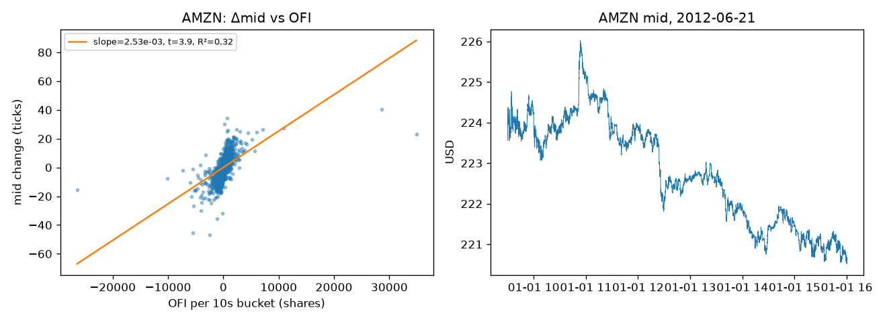
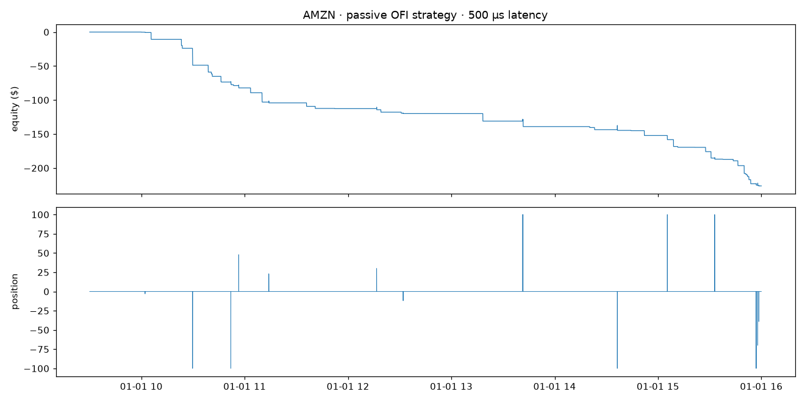
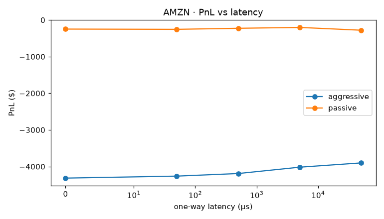

# lob-backtester

A limit order book reconstruction engine and event-driven backtester, built
from raw exchange message data. The core is C++17, exposed to Python through
pybind11; the data pipeline runs on Parquet.

Given a NASDAQ order-by-order message feed (from [LOBSTER](https://lobsterdata.com)),
this project:

1. **Reconstructs the full order book** — every resting order, its price, and
   its exact queue position — with O(1) add/cancel/execute and validates the
   result against LOBSTER's own snapshots row by row.
2. **Replays a trading strategy against that real history** in an event-driven
   backtester that models latency, queue-position fills, and transaction
   costs, so a strategy never sees the future and never fills for free.
3. **Tests an order-flow-imbalance signal** end to end: is it statistically
   real, and does it survive contact with realistic execution?

## Why this exists

Most retail-grade backtests compute a signal and assume every order fills
instantly at the observed price. That assumption alone is enough to make a
losing strategy look profitable. This project exists to show the honest
alternative: replay real market events one at a time, make a simulated order
wait in the same queue a real order would, delay every action by a realistic
network latency, and only credit a fill when the historical order flow
actually justifies one.

## Results

Reconstruction vs. LOBSTER's own orderbook file, all rows, all 5 sample
tickers (AMZN, AAPL, GOOG, INTC, MSFT):

| mode | L1 exact | top-10 exact |
|---|---|---|
| message replay only | 0.8–5.2 % | ≈0 % |
| + price-priority inference (message-only) | 49–76 % | ≈0 % |
| + snapshot resync at the 10-level window boundary | **100 %** | **100 %** |

A level-10 message file only reports events inside the top 10 price levels, so
a level pushed out of the window can change with no record of it — pure
message replay cannot be exact. Two remedies close the gap: price-priority
inference (message-only, provably sound — see `docs/FAQ.md`) and reconciling
against the snapshot file at the window boundary, which uses no future
information and gets every row exactly right. Full writeup in
`docs/LOBSTER_FORMAT.md`.

**Throughput:** 26–34M messages/s for pure book replay (30–38 ns/message); a
full trading day through the event-driven backtester runs in ~40 ms.

**Signal:** an order-flow-imbalance regression (Cont–Kukanov–Stoikov, 10 s
buckets) is significant on all five tickers (t-stats 2.6–21.4, R² 0.16–0.72):



But a naive threshold strategy built on that signal **loses money after
costs** — about 3¢/share on AMZN/AAPL — because passive fills happen exactly
when the market is about to move against them:



This is the backtester doing its job: a naive backtest that fills every limit
order for free would have shown a profit here. Latency exposes the same
effect from a different angle — an aggressive (spread-crossing) variant of
the strategy is sensitive to how fast its orders reach the exchange, because
zero latency lets it react to information the market has already priced in:



Full experiment set (cancel-model sensitivity, per-ticker mark-outs, a
Python-vs-C++ strategy comparison) is in `notebooks/03_backtest_results.ipynb`.

## Architecture

```
LOBSTER message CSV ──▶ Parquet (typed, columnar) ──▶ numpy columns (zero-copy)
                                                              │
                                                    pybind11 boundary (GIL released)
                                                              │
                                                              ▼
                               ┌─────────────────────────────────────────────┐
                               │  C++17 core                                 │
                               │  OrderBook: price-level map + intrusive     │
                               │    per-level FIFO lists + order-id hash map │
                               │  Replay: applies messages, emits OFI, best  │
                               │    bid/ask, and top-k snapshots per event   │
                               │  Backtester: merges historical messages     │
                               │    with latency-delayed strategy actions;   │
                               │    queue-position fill model; fees          │
                               └─────────────────────────────────────────────┘
                                                              │
                                                              ▼
                        Python: validation, OFI research, backtest sweeps, notebooks
```

## Quickstart

```bash
uv venv --python 3.11 .venv
uv pip install --python .venv/bin/python pybind11 scikit-build-core ninja numpy pandas pyarrow pytest matplotlib statsmodels jupyter
uv pip install --python .venv/bin/python -e . --no-build-isolation      # builds lob._lob

.venv/bin/python scripts/fetch_samples.py        # 5 tickers, 2012-06-21, level 10 (~600 MB CSV)
.venv/bin/python scripts/convert.py              # -> data/parquet (8-15x smaller)
.venv/bin/python scripts/validate_all.py         # reconstruction vs LOBSTER snapshots
.venv/bin/python scripts/run_backtest.py --ticker AMZN --latency-us 500
.venv/bin/python scripts/run_backtest.py --all --latency-sweep

# C++ tests and benchmark
cmake -S . -B build -G Ninja -DCMAKE_MAKE_PROGRAM=$PWD/.venv/bin/ninja -DCMAKE_BUILD_TYPE=Release
cmake --build build && ./build/lob_tests && ./build/replay_bench data/raw/AMZN_2012-06-21_34200000_57600000_message_10.csv
.venv/bin/python -m pytest python/tests
```

`scripts/fetch_samples.py` pulls LOBSTER's free academic sample day from a
public mirror if `lobsterdata.com` isn't reachable directly; see the script
for the manual fallback.

## Repository layout

```
cpp/include/lob/  types, order, price_level, order_pool, book_side, order_book, lobster, replay,
                  event, fill_model, costs, portfolio, strategy, ofi_strategy, backtester, metrics
cpp/src/          implementations           cpp/tests/  GoogleTest      cpp/bench/  replay_bench
bindings/         pybind11 module           python/lob/ data, reconstruct, validate, signals, research, backtest
scripts/          fetch_samples, convert, validate_all, run_backtest, make_notebooks
notebooks/        01 data+book, 02 OFI regression, 03 backtest results
docs/             design docs and the FAQ below
```

## Testing

- **C++**: 29 GoogleTest cases covering the order book, LOBSTER message
  semantics, replay, the fill model, and the backtester, including a
  300k-operation fuzz test against a naive reference book. Also runs clean
  under AddressSanitizer/UBSan (`-DLOB_SANITIZE=ON`).
- **Python**: pybind11 bindings, the Python-strategy trampoline, latency
  behavior, and end-to-end validation against real LOBSTER data.

## Documentation

- [`docs/DESIGN.md`](docs/DESIGN.md) — architecture, data structures, the fill
  model, and the pybind11 boundary in detail.
- [`docs/LOBSTER_FORMAT.md`](docs/LOBSTER_FORMAT.md) — the message/orderbook
  file formats and the level-window reconstruction problem.
- [`docs/FAQ.md`](docs/FAQ.md) — the reasoning behind each design decision,
  organized by topic, with numbers to reproduce.

## Data and attribution

Uses [LOBSTER](https://lobsterdata.com)'s free academic sample data (one day,
five tickers, 2012-06-21, 10 price levels), which this repository does not
redistribute — `scripts/fetch_samples.py` downloads it at run time. The
order-flow-imbalance signal follows Cont, Kukanov & Stoikov,
*"The Price Impact of Order Book Events"* (2014).

## Known limitations

- One trading day of sample data — nothing here is a live-trading PnL claim.
- No market impact: simulated orders never remove liquidity from the replayed
  history.
- The cancel-ahead-of-us assumption (pessimistic / pro-rata / optimistic) is
  a configurable model, not something recoverable from the data.
- Single venue, no hidden-liquidity queue model.

## License

MIT — see [`LICENSE`](LICENSE).
